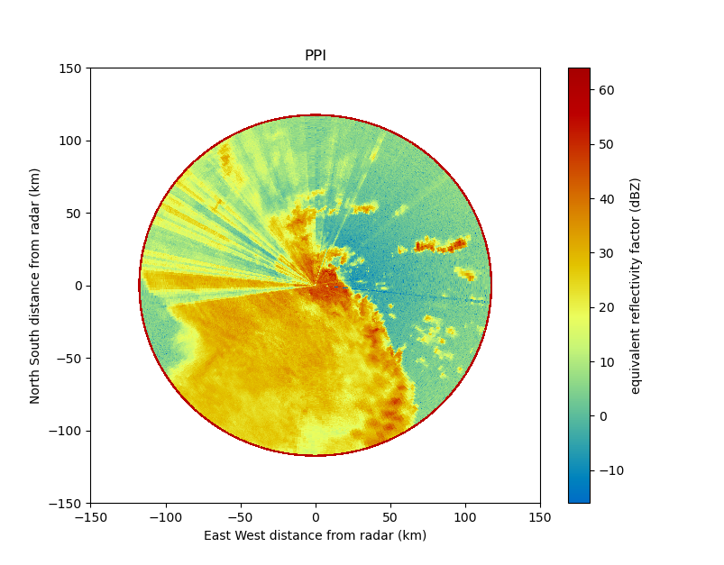

=====================================
The Python ARM Radar Toolkit - Py-ART
=====================================

.. toctree::
   :maxdepth: 2
   :hidden:
   :caption: User Guide

   userguide/index.rst

.. toctree::
   :maxdepth: 2
   :hidden:
   :caption: Reference Guide

   API/index.rst

.. toctree::
   :maxdepth: 2
   :hidden:
   :caption: Developer's Guide

   dev/index.rst

.. toctree::
   :maxdepth: 2
   :hidden:
   :caption: Example Gallery

   examples/index.rst

.. toctree::
   :maxdepth: 2
   :hidden:
   :caption: Notebook Gallery

   notebook-gallery.rst

.. toctree::
   :maxdepth: 1
   :hidden:
   :caption: Blog

   blog.md

.. toctree::
   :maxdepth: 1
   :hidden:
   :caption: Changelog

   changelog.md

.. grid:: 1 2 2 2
    :gutter: 2

    .. grid-item-card:: :octicon:`book;10em`
        :link: https://projectpythia.org/radar-cookbook
        :text-align: center

        **Radar Cookbook**

        The cookbook provides in-depth information on how
        to use Py-ART (and other open radar packages), including how to get started.
        This is where to look for general conceptual descriptions on how
        to use parts of Py-ART, like its support for corrections and gridding.

    .. grid-item-card:: :octicon:`list-unordered;10em`
        :link: API/index
        :link-type: doc
        :text-align: center

        **Reference Guide**

        The reference guide contains detailed descriptions on
        every function and class within Py-ART. This is where to turn to understand
        how to use a particular feature or where to search for a specific tool

    .. grid-item-card:: :octicon:`terminal;10em`
        :link: dev/index
        :link-type: doc
        :text-align: center

        **Developer Guide**

        Want to help make Py-ART better? Found something
        that's not working quite right? You can find instructions on how to
        contribute to Py-ART here. You can also find detailed descriptions on
        tools useful for developing Py-ART.

    .. grid-item-card:: :octicon:`graph;10em`
        :link: examples/index
        :link-type: doc
        :text-align: center

        **Example Gallery**

        Check out Py-ART's gallery of examples which contains
        sample code demonstrating various parts of Py-ART's functionality.

What is Py-ART?
===============
The Python ARM Radar Toolkit, Py-ART, is a Python module containing a
collection of weather radar algorithms and utilities. Py-ART is used by the
`Atmospheric Radiation Measurement (ARM) Climate Research Facility <https://www.arm.gov/>`_ for working
with data from a number of its `precipitation and cloud radars <https://radar.arm.gov/radar_status>`_, but has been
designed so that it can be used by others in the radar and atmospheric
communities to examine, processes, and analyze data from many types of
weather radars.

Citing Py-ART
=============
If you use Py-ART in your work please cite it in your paper. While the
developers appreciate mentions in the text and acknowledgements citing the
paper helps more.

For Py-ART cite our paper in the `Journal of Open Research Software <https://openresearchsoftware.metajnl.com/articles/10.5334/jors.119/>`_

Helmus, J.J. & Collis, S.M., (2016). The Python ARM Radar Toolkit (Py-ART), a
Library for Working with Weather Radar Data in the Python Programming Language.
Journal of Open Research Software. 4(1), p.e25. DOI: http://doi.org/10.5334/jors.119

For a general citation on Open Radar Software please cite Maik Heistermann in
`BAMS <https://journals.ametsoc.org/doi/full/10.1175/BAMS-D-13-00240.1>`_

M. Heistermann, S. Collis, M. J. Dixon, S. Giangrande, J. J. Helmus, B. Kelley,
J. Koistinen, D. B. Michelson, M. Peura, T. Pfaff, and D. B. Wolff, 2015: The
Emergence of Open-Source Software for the Weather Radar Community. Bull. Amer.
Meteor. Soc. 96, 117–128, doi: 10.1175/BAMS-D-13-00240.1.

What can Py-ART do?
===================
Py-ART has the ability to ingest (read) from a number of common weather radar
formats including Sigmet/IRIS, MDV, CF/Radial, UF, and NEXRAD Level II archive
files. Radar data can be written to NetCDF files which conform to the CF/Radial
convention.

Py-ART also contains routines which can produce common radar plots including
PPIs and RHIs.

|PPI|

|RHI|

.. |RHI| image:: _static/rhi.png

Algorithms in the module are able to performs a number of corrections on the
radar moment data in antenna coordinate including attenuation correction of
the reflectivity, velocity dealiasing, and correction of the specific (Kdp)
and differential (PhiDP) phases.

A sophisticated mapping routines is able to efficiently create uniform
Cartesian grids of radar fields from one or more radars. Routines exist in
Py-ART for plotting these grids as well as saving them to NetCDF files.

Short Courses
=============

Various short courses on Py-ART and open source radar software have been given
which contain tutorial like materials and additional examples.

* `2015 AMS, Open Source Radar Short Course <https://github.com/openradar/AMS-Short-Course-on-Open-Source-Radar-Software>`_
* `2015 ARM/ASR Meeting, PyART, the Python ARM Radar Toolkit  <https://github.com/ARM-DOE/notebooks/tree/master/ASR_PI_2015>`_
* `2014 ARM/ASM Meeting, Py-ART tutorial <https://github.com/ARM-DOE/notebooks/tree/master/ASR_PI_2014>`_
* `2014 ERAD, Open Source Radar Short Course <https://github.com/openradar/open_source_radar_short_course>`_

Install
=======

The easiest method for installing Py-ART is to use the conda packages from
the latest release and use Python 3, as Python 2 support ended January 1st,
2020 and many packages including Py-ART no longer support Python 2.
To do this you must download and install
`Anaconda <https://www.anaconda.com/download/#>`_ or
`Miniconda <https://conda.io/miniconda.html>`_.
With Anaconda or Miniconda install, it is recommended to create a new conda
environment when using Py-ART or even other packages. To create a new
environment based on the `environment.yml <https://github.com/ARM-DOE/pyart/blob/master/environment.yml>`_::

    conda env create -f environment.yml

Or for a basic environment and downloading optional dependencies as needed::

    conda create -n pyart_env -c conda-forge python=3.8 arm_pyart

Basic command in a terminal or command prompt to install the latest version of
Py-ART::

    conda install -c conda-forge arm_pyart

To update an older version of Py-ART to the latest release use::

    conda update -c conda-forge arm_pyart

If you do not wish to use Anaconda or Miniconda as a Python environment or want
to use the latest, unreleased version of Py-ART clone the git repository or
download the repositories zip file and extract the file. Then run:

$ python setup.py install

Additional detail on installing Py-ART can be found in the installation section.

Dependencies
============

Py-ART is tested to work under Python 3.6, 3.7 and 3.8

The required dependencies to install Py-ART in addition to Python are:

* `NumPy <https://www.numpy.org/>`_
* `SciPy <https://www.scipy.org>`_
* `matplotlib <https://matplotlib.org/>`_
* `netCDF4 <https://github.com/Unidata/netcdf4-python>`_

A working C/C++ compiler is required for some optional modules. An easy method
to install these dependencies is by using a
`Scientific Python distributions <http://scipy.org/install.html>`_.
`Anaconda Compilers <https://www.anaconda.com/distribution/>`_ will install
all of the above packages by default on Windows, Linux and Mac computers and is
provided free of charge by Anaconda. Anaconda also has their own compilers,
which may be required for optional dependencies such as CyLP. These compilers
can be found here:
https://docs.conda.io/projects/conda-build/en/latest/resources/compiler-tools.html

Optional Dependences
====================

The above Python modules are require before installing Py-ART, additional
functionality is available of the following modules are installed.

* `TRMM Radar Software Library (RSL)
  <https://trmm-fc.gsfc.nasa.gov/trmm_gv/software/rsl/>`_.
  If installed Py-ART will be able t`o read in radar data in a number of
  additional formats (Lassen, McGill, Universal Format, and RADTEC) and
  perform automatic dealiasing of Doppler velocities.  RSL should be
  install prior to installing Py-ART. The environmental variable `RSL_PATH`
  should point to the location where RSL was installed if RSL was not
  installed in the default location (/usr/local/trmm), such as a anaconda path
  (/usr/anaconda3/envs/pyart_env/.

* In order to read files which are stored in HDF5 files the
  `h5py <https://www.h5py.org/>`_ package and related libraries must be
  installed.

* A linear programming solver and Python wrapper to use the LP phase
  processing method. `CyLP <https://github.com/mpy/CyLP>`_ is recommended as
  it gives the fastest results, but
  `PyGLPK <https://tfinley.net/software/pyglpk/>`_ and
  `CVXOPT <https://cvxopt.org/>`_ are also supported. The underlying LP
  solvers `CBC <https://projects.coin-or.org/Cbc>`_ or
  `GLPK <https://www.gnu.org/software/glpk/>`_ will also be required depending
  on which wrapper is used. When using `CyLP <https://github.com/mpy/CyLP>`_
  a path to coincbc is needed by setting the `COIN_INSTALL_DIR` path, such as
  (/usr/anaconda3/envs/pyart_env/).

* `Cartopy <https://scitools.org.uk/cartopy/docs/latest/>`_. If installed,
  the ability to plot grids on geographic maps is available.

* `xarray <https://xarray.pydata.org/en/stable/>`_. If installed, gives the
  ability to work with the grid dataset used in grid plotting.

* `Basemap <https://matplotlib.org/basemap/>`_. If installed, also gives the
  ability to plot grids on geographic maps, but Cartopy is recommended over
  Basemap.

* `wradlib <https://docs.wradlib.org/en/latest/>`_. Needed to calculate the texture
  of a differential phase field.

* `pytest <https://docs.pytest.org/en/latest/>`_.
  Required to run the Py-ART unit tests.

* `gdal <https://pypi.python.org/pypi/GDAL/>`_.
  Required to output GeoTIFFs from `Grid` objects.

Getting help
============
Py-ART has a `mailing list <https://groups.google.com/forum/#!forum/pyart-users>`_ where you can ask questions and request help.

Contributing
============
Py-ART is an open source software package distributed under the `New BSD License <https://opensource.org/licenses/BSD-3-Clause>`_
Source code for the package is available on `GitHub <https://github.com/ARM-DOE/pyart>`_. Feature requests and bug reports
can be submitted to the `Issue tracker <https://github.com/ARM-DOE/pyart/issues>`_, posting to the pyart-users `mailing list <https://groups.google.com/forum/#!forum/pyart-users>`_.
Contributions of source code, documentation or additional example are always
appreciated from both developers and users. To learn more on contributing to Py-ART, see
the contributor's guide.
